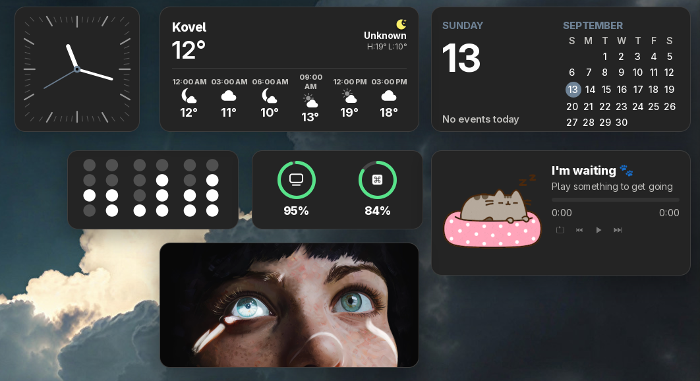

# Desktop Widgets

Desktop widgets for GNOME Shell: clock, binary clock, calendar, weather, music, photos, and battery. Widgets are placed directly on your desktop background, snapped to a grid, and moved around freely in edit mode.

A fork of [Widgets](https://github.com/TheRealSourcer/widgets) by TheRealSourcer.



## Features

- **Grid layout** — widgets snap to a desktop grid and can be freely arranged in edit mode.
- **Eight sizes** — mini (2×1), small (1×1), medium (2×1), portrait (1×2), large (2×2), tall (2×4), wide (4×2), huge (4×4).
- **Edit mode** — add, move, resize, and remove widgets; bind a global shortcut to toggle it.
- **Custom styling** — border radius, border width and color, background color, box shadow, and global opacity.
- **Translations** — Ukrainian and Russian.

## Widgets

| Widget | Description |
| --- | --- |
| Clock | Digital clock and date. |
| Binary clock | Time shown in binary. |
| Calendar | Compact monthly calendar. |
| Weather | Current conditions and temperature, uses your GNOME Weather location. |
| Photos | Rotating photos from your folders, or a custom photo of your choice. |
| Battery | Charge rings for the computer and connected Bluetooth devices. |
| Music | Now playing via MPRIS (GNOME Music, Amberol, VLC, …). |

## Requirements

- GNOME Shell 50
- GNOME Weather installed (for the Weather widget)

## Installation

### From source

```bash
git clone https://github.com/r3nhick/desktop-widgets.git
cd desktop-widgets
cp -r . ~/.local/share/gnome-shell/extensions/desktop-widgets@r3nhick
```

Restart GNOME Shell (`Alt`+`F2`, then `r`) and enable the extension with the Extensions app.

### Installing mpris (music widget)

The Music widget picks up any MPRIS player on the bus (GNOME Music, Amberol, VLC, Spotube, …). Browsers with tab media (Chrome, Firefox) are ignored by default; you can disable this in settings.

## Usage

- Open the extension settings via the Extensions app to add, remove, and arrange widgets.
- Toggle **Edit mode** (keyboard shortcut, configurable) to drag widgets freely on the desktop.
- Use **Arrange widgets** to align everything into a clean grid.

## Development

Extract translatable strings:

```bash
node tools/extract-strings.mjs
```

Compile translations:

```bash
msgfmt po/uk.po -o po/uk.mo
msgfmt po/ru.po -o po/ru.mo
```

Pack the extension:

```bash
gnome-extensions pack \
  --extra-source=widgets/ --extra-source=schemas/ --extra-source=po/ --extra-source=assets/ \
  --extra-source=paths.js --extra-source=logger.js --extra-source=utils.js --extra-source=workspaceIntegration.js \
  .
```

## License

Released into the public domain under the [Unlicense](https://unlicense.org). See [LICENSE](LICENSE).