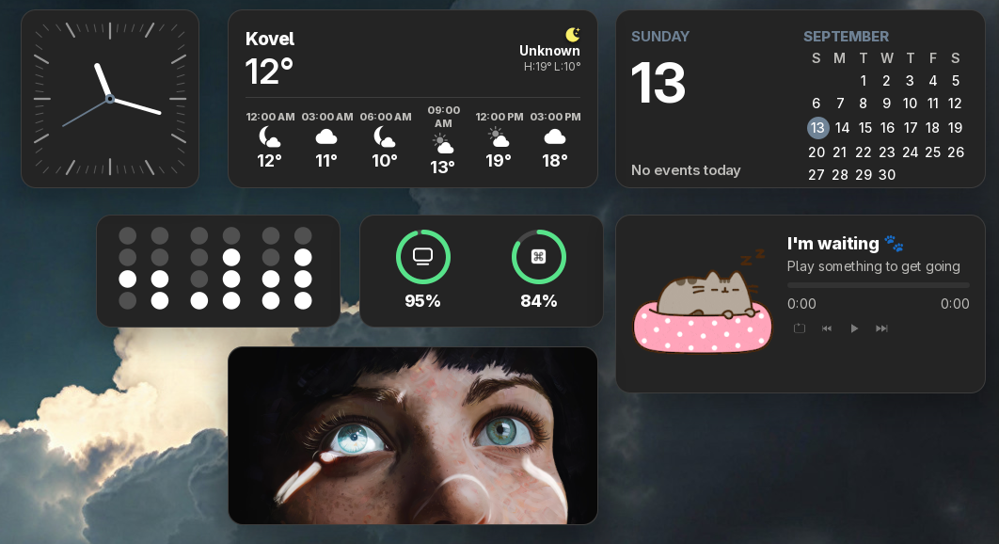
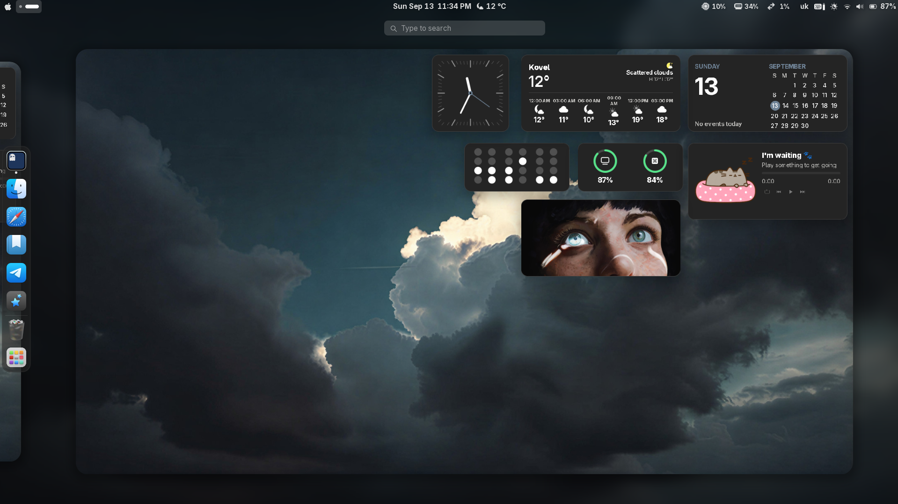
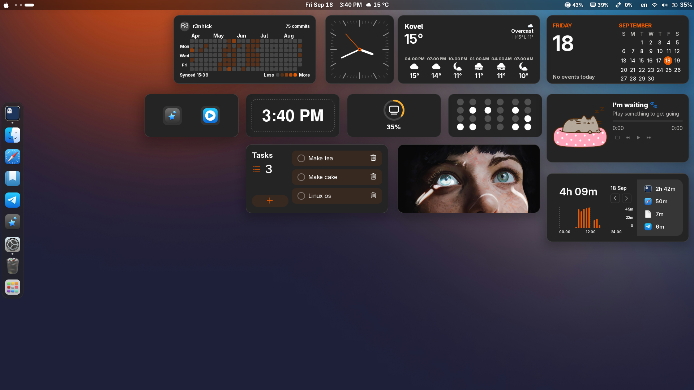
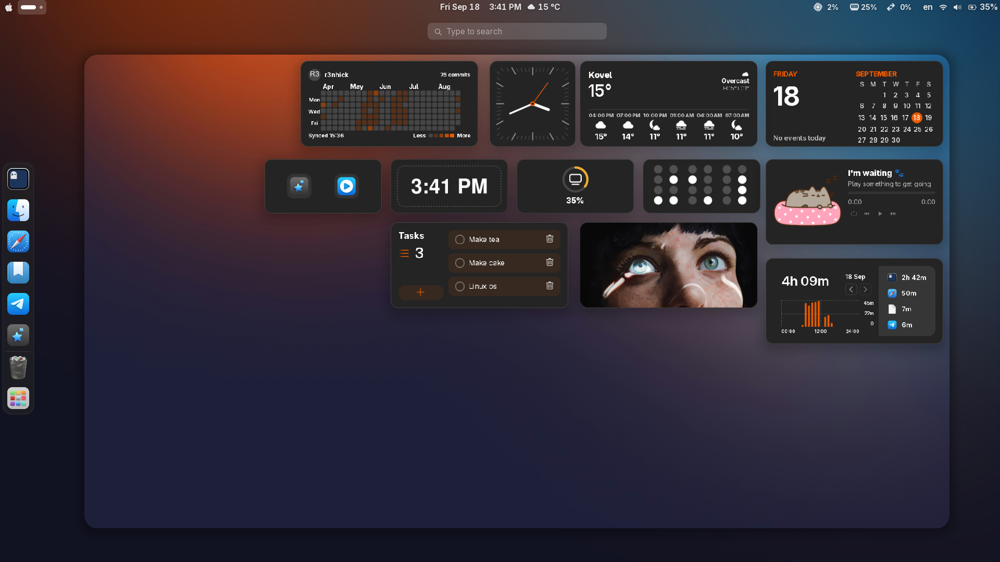
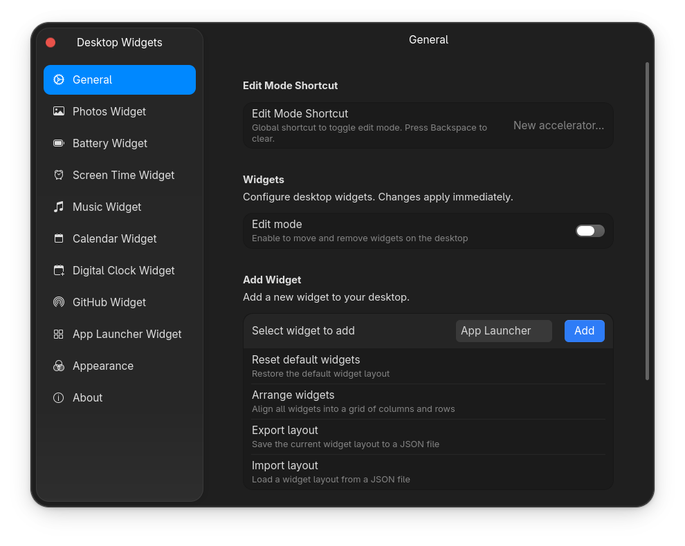

# Desktop Widgets

Desktop widgets for GNOME Shell: clock, calendar, weather, music, photos, battery, and more. Widgets are placed directly on your desktop background, snapped to a grid, and moved around freely in edit mode.

A fork of [Widgets](https://github.com/TheRealSourcer/widgets) by TheRealSourcer.











> **⚠️ Desktop Icons NG (DING) conflict**
>
> If you have the **Desktop Icons NG (DING)** extension enabled, the desktop
> widgets are **not clickable** — the icons layer sits on top of them. To get
> fully interactive widgets, **disable DING** (Extensions app → Desktop Icons
> NG → switch off, or run `gnome-extensions disable ding@rastersoft.com`).

## Features

- **Grid layout** — widgets snap to a desktop grid and can be freely arranged in edit mode.
- **Multiple sizes** — mini (2×1), small (1×1), medium (2×1), portrait (1×2), large (2×2), tall (2×4), wide (4×2), huge (4×4).
- **Edit mode** — add, move, resize, and remove widgets; bind a global shortcut to toggle it.
- **Custom styling** — border radius, border width and color, background color, box shadow, and global opacity.
- **Live updates** — many settings apply immediately without restarting GNOME Shell.
- **Translations** — Ukrainian and Russian.

## Widgets

| Widget | Description | Sizes |
| --- | --- | --- |
| **Clock** | Digital clock and date | All sizes |
| **Binary Clock** | Time shown in binary format | Small, medium, large |
| **Calendar** | Compact monthly calendar with current day highlight | Medium, portrait, large |
| **Weather** | Current conditions and temperature (uses GNOME Weather location) | All sizes |
| **Photos** | Rotating photos from folders or custom photo | All sizes |
| **Battery** | Charge rings for computer and connected Bluetooth devices | Small, medium, large |
| **Music** | Now playing via MPRIS (GNOME Music, Amberol, VLC, etc.) | Medium, portrait, large |
| **Stopwatch** | Elapsed time counter with start/pause/reset controls | Medium, large |
| **Timer** | Countdown timer with adjustable time and circular progress | Medium (2×1) |
| **Folder Launcher** | Quick access to folders with customizable file manager | Medium, large |
| **Pomodoro** | Pomodoro technique timer with work/break cycles | Small |
| **Lava Lamp** | Animated decorative lava lamp effect | Medium, large |
| **GitHub** | GitHub profile statistics and contribution graph | Large, wide |
| **Apps** | Quick launcher for pinned applications | Medium, large, wide |
| **Screen Time** | Daily usage statistics and time tracking | Medium, large |
| **Tasks** | Simple todo list with checkboxes | Medium, portrait, large, tall |

## Requirements

- GNOME Shell 50
- GNOME Weather installed (for the Weather widget)

## Installation

### From source

```bash
git clone https://github.com/r3nhick/desktop-widgets.git
cd desktop-widgets
mkdir -p ~/.local/share/gnome-shell/extensions
cp -r . ~/.local/share/gnome-shell/extensions/desktop-widgets@r3nhick
```

Log out of your session and log back in to restart GNOME Shell, then enable the extension via the Extensions app.

### Updating

To update to a newer version:

```bash
cd ~/.local/share/gnome-shell/extensions/desktop-widgets@r3nhick
git pull
```

Then log out and log back in to restart GNOME Shell.

If `git pull` fails because of local changes, the installed copy was
modified on this machine. To reset it to the latest version:

```bash
git reset --hard origin/main
git clean -fd
```

**Note:** this discards any changes made directly in the installed folder.

### Uninstalling

```bash
rm -rf ~/.local/share/gnome-shell/extensions/desktop-widgets@r3nhick
```

Then log out and log back in to restart GNOME Shell.

To also remove widget data (pinned apps, tasks, GitHub profiles, screen-time history):

```bash
rm -rf ~/.local/share/desktop-widgets@r3nhick
gsettings reset-recursively org.gnome.shell.extensions.desktop-widgets-r3nhick
```

## Usage

- Open the extension settings via the Extensions app to add, remove, and arrange widgets.
- Toggle **Edit mode** (keyboard shortcut, configurable) to drag widgets freely on the desktop.
- Use **Arrange widgets** to align everything into a clean grid.
- Many widgets support multiple sizes — resize them in the widget settings or edit mode.
- Settings changes apply immediately for most widgets without needing to restart GNOME Shell.

## Widget-specific features

### Timer
- Manual time adjustment with +/- buttons (±1 and ±10 minutes/seconds)
- Two modes: setup (adjust time) and running (shows time with progress)
- Circular progress indicator
- Pause and stop controls
- Desktop notification when timer finishes

### Folder Launcher
- Opens folders in your preferred file manager (Nautilus, Dolphin, Thunar, Nemo, etc.)
- Real folder icons from filesystem
- Optional folder name labels
- Settings apply immediately

### Stopwatch
- Counts elapsed time upward from zero
- Large, easy-to-read display
- Start, pause, reset controls

### GitHub
- Shows profile picture, username, and bio
- Contribution graph for the past year
- Repository and follower counts
- Caches data to work offline

## Development

Regenerate the compiled schema after editing `schemas/*.gschema.xml`:

```bash
glib-compile-schemas schemas/
```

Extract translatable strings:

```bash
node tools/extract-strings.mjs
```

Compile translations:

```bash
msgfmt po/uk.po -o locale/uk/LC_MESSAGES/desktop-widgets@r3nhick.mo
msgfmt po/ru.po -o locale/ru/LC_MESSAGES/desktop-widgets@r3nhick.mo
```

Pack the extension:

```bash
gnome-extensions pack \
  --extra-source=widgets/ --extra-source=schemas/ --extra-source=assets/ --extra-source=utils/ \
  --extra-source=paths.js --extra-source=logger.js --extra-source=workspaceIntegration.js \
  .
```

## Contributing

Contributions are welcome! Feel free to:
- Report bugs or request features via GitHub Issues
- Submit pull requests with improvements or new widgets
- Translate the extension to your language

When adding a new widget:
1. Create `widgets/your-widget/widget.js` with required exports
2. Register it in `extension.js` (WIDGET_MODULES)
3. Add preferences in `prefs.js` if needed
4. Add an icon to `assets/icons/your-widget.svg`
5. Update this README

## License

This project is licensed under the [GNU General Public License v3.0](https://www.gnu.org/licenses/gpl-3.0.html). See [LICENSE](LICENSE).
